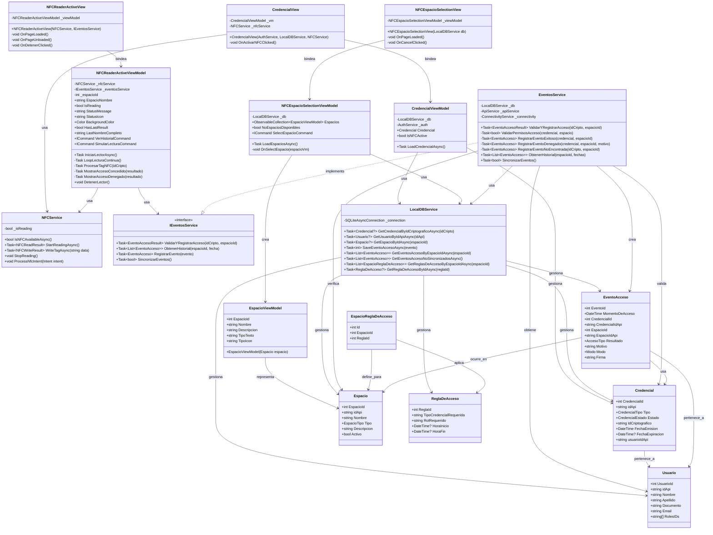

# ??? Diagrama de Arquitectura del Sistema NFC

## Diagrama de Clases

## Diagrama de Secuencia - Flujo Completo

## Diagrama de Componentes

## Estados del Sistema

---

?? **Nota**: Estos diagramas muestran la arquitectura completa del sistema NFC, incluyendo todos los componentes, relaciones y flujos de datos.
