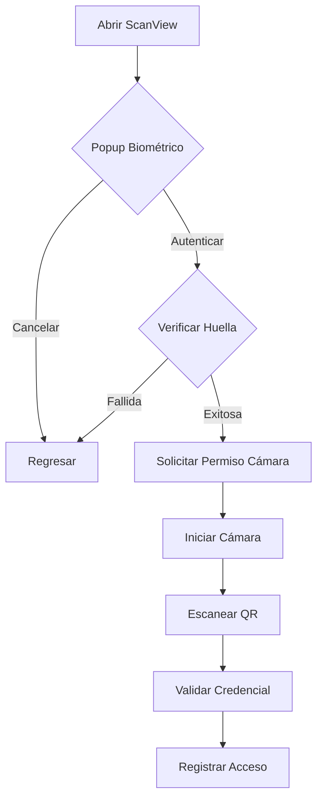
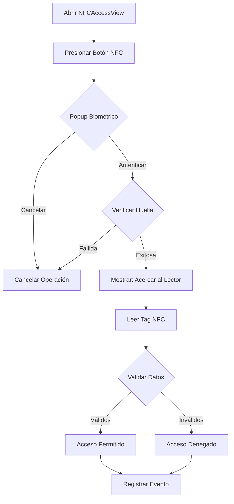

# Implementación de Autenticación Biométrica y NFC

## ?? Resumen de Cambios

Se ha implementado un sistema de seguridad de doble factor que combina:
1. **Autenticación Biométrica** (huella digital)
2. **Validación mediante NFC o QR**

## ?? Nuevos Archivos Creados

### Servicios

1. **`Services/BiometricService.cs`**
   - Maneja la autenticación biométrica (huella digital)
   - Verifica disponibilidad del sensor
   - Solicita autenticación al usuario

2. **`Services/NFCService.cs`**
   - Maneja lectura y escritura de tags NFC
   - Verifica disponibilidad de NFC en el dispositivo
   - Lee datos del formato: `cryptoId|espacioId`

### Vistas

3. **`Views/BiometricAuthPopup.xaml` y `.cs`**
   - Popup que solicita autenticación biométrica
   - Muestra instrucciones al usuario
   - Botones de "Autenticar" y "Cancelar"

4. **`Views/NFCAccessView.xaml` y `.cs`**
   - Vista para usuarios normales para acceder con NFC
   - Flujo completo: biometría ? lectura NFC ? validación
   - Registro de eventos de acceso

### Utilidades

5. **`Converters/InvertedBoolConverter.cs`**
   - Convierte booleanos a su inverso
   - Usado para mostrar/ocultar botones según rol

## ?? Archivos Modificados

### 1. `Views/ScanView.xaml.cs`
**Cambios:**
- ? Agregado `BiometricService` como dependencia
- ? Solicita autenticación biométrica ANTES de iniciar cámara
- ? Flag `_biometricAuthenticated` para verificar estado
- ? Validación en `BarcodesDetected` para verificar autenticación

**Flujo actualizado:**
```
1. Usuario entra a ScanView
2. Se muestra popup de autenticación biométrica
3. Si autentica correctamente ? solicita permisos de cámara
4. Si falla o cancela ? regresa a pantalla anterior
5. Solo puede escanear si está autenticado biométricamente
```

### 2. `AppShell.xaml.cs`
**Cambios:**
- ? Registrada nueva ruta: `"nfcAccess"` ? `NFCAccessView`

### 3. `MauiProgram.cs`
**Cambios:**
- ? Registrado `BiometricService` como Singleton
- ? Registrado `NFCService` como Singleton
- ? Registrado `NFCAccessView` como Singleton

### 4. `Views/Navbar.xaml`
**Cambios:**
- ? Agregado botón de acceso NFC
- ? Visible solo para usuarios NO funcionarios
- ? Usa `InvertedBoolConverter` para inversión de visibilidad

## ?? Flujos de Autenticación

### Para Funcionarios (Escanear QR)



### Para Usuarios (Acceso NFC)



## ?? Validaciones de Seguridad

### 1. Autenticación Biométrica Obligatoria
- ? No se puede escanear QR sin autenticación previa
- ? No se puede leer NFC sin autenticación previa
- ? Cada sesión requiere nueva autenticación

### 2. Validación de Credenciales
```csharp
// Para QR y NFC se valida:
1. Usuario logueado existe
2. Espacio existe y está activo
3. Credencial existe y es válida
4. IdCriptográfico coincide con el esperado
5. Se registra el evento (permitido o denegado)
```

### 3. Registro de Eventos
Todos los intentos de acceso se registran con:
- ? Timestamp exacto
- ? Usuario que intenta acceder
- ? Espacio solicitado
- ? Resultado (Permitir/Denegar)
- ? Motivo (éxito/fallo)
- ? Método usado (QR/NFC)

## ?? Diferencias entre Roles

| Característica | Funcionario | Usuario Normal |
|----------------|-------------|----------------|
| Método de validación | Escanea QR de otros | Lee NFC del espacio |
| Vista principal | `ScanView` | `NFCAccessView` |
| Autenticación biométrica | ? Obligatoria | ? Obligatoria |
| Registra eventos de | Otros usuarios | Sí mismo |
| Puede escribir NFC | ? Sí (futuro) | ? No |

## ?? Formato de Datos

### QR Code Format
```
cryptoId|espacioId
```
**Ejemplo:**
```
abc123xyz|esp-001
```

### NFC Tag Format
```
cryptoId|espacioId
```
**Ejemplo:**
```
def456uvw|esp-002
```

## ?? Próximos Pasos (Producción)

### 1. Implementar Plugin de Huella Real
```bash
dotnet add package Plugin.Fingerprint
```

Reemplazar en `BiometricService.cs`:
```csharp
// Simulación actual
bool authenticated = await SimulateBiometricPromptAsync(reason);

// Implementación real
var result = await CrossFingerprint.Current.AuthenticateAsync(
    new AuthenticationRequestConfiguration(reason)
);
bool authenticated = result.Authenticated;
```

### 2. Implementar NFC Real

#### Android (MainActivity.cs):
```csharp
[IntentFilter(new[] { NfcAdapter.ActionNdefDiscovered })]
public class MainActivity : MauiAppCompatActivity
{
    private NfcAdapter _nfcAdapter;
    
    protected override void OnCreate(Bundle savedInstanceState)
    {
        base.OnCreate(savedInstanceState);
        _nfcAdapter = NfcAdapter.GetDefaultAdapter(this);
    }
}
```

#### iOS (Info.plist):
```xml
<key>NFCReaderUsageDescription</key>
<string>Necesitamos acceso a NFC para validar tu acceso</string>
```

### 3. Permisos Requeridos

#### Android (AndroidManifest.xml):
```xml
<uses-permission android:name="android.permission.NFC" />
<uses-permission android:name="android.permission.USE_BIOMETRIC" />
<uses-permission android:name="android.permission.USE_FINGERPRINT" />
```

#### iOS (Info.plist):
```xml
<key>NSFaceIDUsageDescription</key>
<string>Necesitamos verificar tu identidad</string>
```

## ?? Testing

### Pruebas de Autenticación Biométrica
1. Abrir `ScanView` o `NFCAccessView`
2. Verificar que aparece popup de autenticación
3. Cancelar ? debe regresar/cancelar
4. Aceptar ? debe continuar con el flujo

### Pruebas de NFC (Simulado)
1. Ir a `NFCAccessView`
2. Presionar "Acceder con NFC"
3. Autenticar biométricamente
4. Esperar simulación de lectura (3 segundos)
5. Verificar mensaje de éxito/fallo

### Pruebas de QR con Biometría
1. Ir a `ScanView`
2. Autenticar biométricamente
3. Escanear QR válido
4. Verificar registro en historial

## ?? Notas Importantes

1. **Modo Desarrollo**: Los servicios actuales simulan la funcionalidad. En producción, reemplazar con plugins reales.

2. **Seguridad**: La autenticación biométrica se resetea cada vez que se sale de la vista para máxima seguridad.

3. **UX**: El usuario debe autenticarse ANTES de cada operación sensible, no solo al inicio de sesión.

4. **Offline**: Los eventos se guardan localmente y se sincronizan cuando hay conexión.

## ?? Soporte

Para implementar los plugins reales de biometría y NFC, consultar:
- Plugin.Fingerprint: https://github.com/smstuebe/xamarin-fingerprint
- Plugin.NFC: https://github.com/frankencode/Plugin.NFC

## ? Checklist de Implementación

- [x] Crear `BiometricService`
- [x] Crear `NFCService`
- [x] Crear `BiometricAuthPopup`
- [x] Crear `NFCAccessView`
- [x] Modificar `ScanView` con autenticación
- [x] Registrar servicios en DI
- [x] Registrar rutas en AppShell
- [x] Actualizar Navbar con botón NFC
- [ ] Instalar Plugin.Fingerprint (producción)
- [ ] Instalar Plugin.NFC (producción)
- [ ] Configurar permisos nativos
- [ ] Testing en dispositivos físicos
- [ ] Documentar casos de uso
